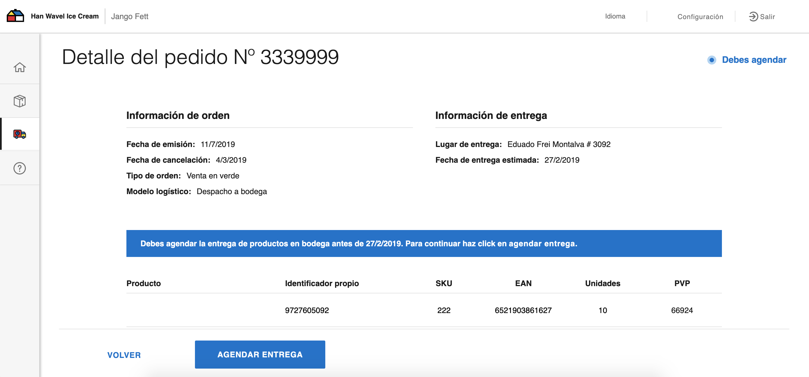

# Jira History
[SLYF-2063](https://jira.adessa.cl/browse/SLYF-2063)

## json a recibir
```js
{
    "message": {
        "header": {
            "channel": "ODBMS",
            "commerce": "SODIMAC",
            "country": "CO",
            "datetime": "2019-04-03T16:27:45",
            "entityType": "purchaseOrder",
            "messageId": "6596A137-932E-4559-B480-DA92402BBD8F",
            "mimeType": "application/json",
            "timestamp": "20190403162745",
            "version": "1.0"
        },
        "metadata": {
            "purchaseOrder": {
                "orderNumber": "9213991",
                "orderType": "MKP",
                "dispatchType": "direct_with_courier",
                "orderStatus": "readyToDispatch"
            },
            
            "additionalAttributes": {
                "pickup": {
                    "address": "avenida siempre viva",
                    "pickupDate": "2019-04-03T16:27:45",
                    "courierName":"CORREOSDECHILE",
                    "docs": [
                        {
                            "type": "dispatchGuide",
                            "url": "dispatchGuideUrl"
                        },
                        {
                            "type": "label",
                            "url": "labelUrl"
                        }
                    ],
                    "deliveryNumber": "01-1795081"
                },
                "trackingNumber": "014994716694"
            }
        }
    }
}
```


## Extracción de campos

<del> * Fecha de retiro confirmada.  
<del> * Empresa que retira: Nombre de la transportadora que va a retirar.  
<del> * Tracking number: en caso de que exista (N°Guía)  
<del> * Dirección de retiro: debería ser la misma que enviamos, la que viene en la orden de compra/declaró el seller  
<del> * N° Solicitud de recolección:  DeliveryNumber  
* Botón para imprimir etiquetas: se descargan las etiquetas del courrier (se abre un link para cada etiqueta que se generó)
* Botón para Descargar Guía: Es el link de la guía que debe imprimir el seller. (solo si el courrier la envía)

```js
{
  "Fecha de retiro confirmada": get(extraParameters, 'metadata.additionalAttributes.pickup.pickupDate'),
  "Empresa que retira": get(extraParameters, 'metadata.additionalAttributes.courrierName'),
  "Tracking number": get(extraParameters, 'metadata.purchaseOrder.trackingNumber')",
  "Dirección de retiro": get(extraParameters, 'metadata.additionalAttributes.pickup.address'),
  "Guía": get(extraParameters, 'metadata.additionalAttributes.pickup.docs')
  "N° Solicitud de recolección": get(extraParameters, 'metadata.additionalAttributes.pickup.deliveryNumber')
}
```

## Aclaración

* Guía: Es el link de la guía que debe imprimir el seller. (solo si el courrier la envía)
* N° Solicitud de recolección:  (solo si el courrier la envía)
* Botón para imprimir etiquetas: se descargan las etiquetas del courrier

## Componentes
* Botón para imprimir etiquetas: se descargan las etiquetas del courrier (se abre un link para cada etiqueta que se generó)
* Botón para Descargar Guía: Es el link de la guía que debe imprimir el seller. (solo si el courrier la envía)


El layout de la vista deberia entregar la información al componente en el siguiente formato:
```
  let labels = [
    {
      type: 'dispatchGuide',
      url: 'http://200.69.100.66/2impresionGuiaspruebas/Guia3.aspx?Usuario=EMPCAR01&Guia=014994716694'
    },
    {
      type: 'label',
      url: 'http://200.69.100.66/2IMPRESIONGUIASpruebas/ISticker_ZEA.aspx?Guia=014994716694'
    },
    {
      type: 'label',
      url: 'http://200.69.100.66/2IMPRESIONGUIASpruebas/ISticker_ZEA.aspx?Guia=014994716694'
    },
    {
      type: 'label',
      url: 'http://200.69.100.66/2IMPRESIONGUIASpruebas/ISticker_ZEA.aspx?Guia=014994716694'
    }
  ];
```
`<Label labels={labels} />`


```js
import React from 'react';
import PropTypes from 'prop-types';

function Label({ labels }) {
  const handleClick = () => {
    labels.map(label => window.open(label.url));
  };
  return (
    <div>
      <a onClick={handleClick} target="_blank">
        Descargar etiquetas
      </a>
    </div>
  );
}
Label.propTypes = {
  labels: PropTypes.array.isRequired
};

export default Label;
```


### Extracción de la guia

```js
const getDispatchGuide = ()=>{
    const dispatchGuide = obj.pickup.docs.filter(doc=>doc.type==="dispatchGuide")[0]
    return dispatchGuide
}

```
### Extracción de la guia
```js
const getLabels = () => {
    const labels = obj.pickup.docs.filter(doc=>doc.type==="label")
    return labels
}

```


### TABS
`path:svl-frontend-react/src/app/logistic/sodimac/screens/Dashboard/screens/MFNOrdersManagement/constants.js` 
```js

export const MFN_TABS = [
  {
    id: TABS.awaitingScheduling,
    title: i18next.t('MFNOrdersManagement:awaitingScheduling')
  },
  {
    id: TABS.pending,
    title: i18next.t('MFNOrdersManagement:inPreparation')
  },
  {
    id: TABS.delivered,
    title: i18next.t('MFNOrdersManagement:deliveries')
  },
  {
    id: TABS.all,
    title: i18next.t('MFNOrdersManagement:all')
  }
];
```


## vistas


path: `/src/app/logistic/sodimac/screens/Dashboard/screens/MFNOrdersManagement/components/XDockOrderDetails/index.js`

## Información de entrega

Layout:
`/src/app/logistic/sodimac/screens/Dashboard/screens/MFNOrdersManagement/components/XDockOrderDetails/layout.js`


```js
<InformationTable
    info={deliveryInfo}
    className="full-width m-left-2"
    attributesListClassName="column full-width m-top-2"
    attributeClassName="row start"
    title={i18next.t('MFNOrdersManagement:deliveryInformationTitle')}
    infoAttributes={DELIVERY_ATTRIBUTES}
/>
```
## deliveryInfo
info sera la información que contendra los datos en el siguiente formato
```js
{expectedDate: "27/2/2019", deliveryAddress: "Eduado Frei Montalva  # 3092"}
```

## footer button
path: `src/app/logistic/sodimac/screens/Dashboard/screens/MFNOrdersManagement/components/XDockOrderDetails/components/LogisticOrderXDockDetailFooter/index.js`

## direct_with_courier
La vista de detalle debe tener un flujo diferente a las demas y debe estar en gris hasta que llegue la información y pueda habilitarse las opciones para descargar las guias y etiquetas
